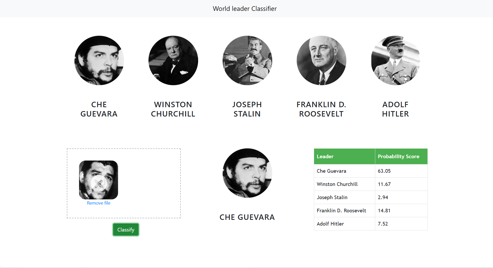
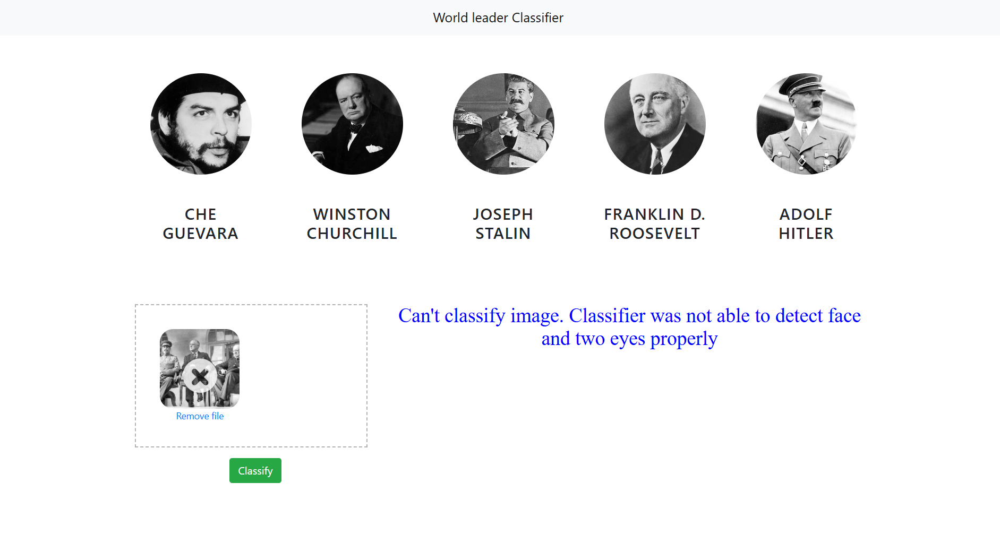

# 🌍 World Leaders Face Recognition System

A Machine Learning and Computer Vision project that identifies famous world leaders from facial images using OpenCV, Wavelet Transform feature extraction, and a Support Vector Machine (SVM) classifier. 

The application provides a web interface where users can upload an image and receive the predicted leader along with confidence scores for all classes.


### Home Page



### Prediction Result



## 🚀 Features 

* Face detection using OpenCV Haar Cascades
* Eye detection for image validation
* Automatic face cropping
* Wavelet Transform feature extraction
* SVM-based classification
* Probability score display for all classes
* Interactive web interface with drag-and-drop image upload
* Flask REST API backend

## 🧠 Leaders Recognized

* Che Guevara
* Winston Churchill
* Joseph Stalin
* Franklin D. Roosevelt
* Adolf Hitler

## 🛠️ Tech Stack

### Machine Learning & Computer Vision

* Scikit-Learn
* Support Vector Machine (SVM)
* OpenCV
* jQuery
* PyWavelets
* NumPy
* Joblib

### Backend

* Flask

### Frontend

* HTML5
* CSS3
* JavaScript
* Bootstrap
* Dropzone.js

## 📂 Project Structure

```text
World_leaders_face_Recognition/
│
├── model/
│   ├── World_Leaders_Classification.ipynb
│   ├── World_leaders_CNN_recognition.ipynb
│   ├── saved_model.pkl
│   ├── class_dictionary.json
│   ├── dataset/
│   └── test_images/
│
├── server/
│   ├── server.py
│   ├── util.py
│   ├── wavelet.py
│   └── artifacts/
│       ├── saved_model.pkl
│       └── class_dictionary.json
│
└── UI/
    ├── app.html
    ├── app.css
    ├── app.js
    ├── dropzone.min.css
    ├── dropzone.min.js
    └── images/
```

## 🔍 Classification Pipeline

1. Upload image through the web interface.
2. Detect face using Haar Cascade.
3. Verify presence of at least two eyes.
4. Crop the facial region.
5. Resize image to 32×32 pixels.
6. Apply Wavelet Transform.
7. Combine raw image and wavelet features.
8. Generate feature vector.
9. Predict leader using trained SVM classifier.
10. Display prediction probabilities.

## ⚙️ Installation

Clone the repository:

```bash
git clone <repository-url>
cd World_leaders_face_Recognition
```

Install dependencies:

```bash
pip install -r requirements.txt
```

## ▶️ Run the Project

Start the Flask server:

```bash
cd server
python server.py
```

Open:

```text
UI/app.html
```

or launch the UI using VS Code Live Server.

## 📊 Example Output

| Leader                | Probability |
| --------------------- | ----------- |
| Che Guevara           | 2.15%       |
| Winston Churchill     | 3.42%       |
| Joseph Stalin         | 89.11%      |
| Franklin D. Roosevelt | 3.01%       |
| Adolf Hitler          | 2.31%       |

Predicted Class:

```text
Joseph Stalin
```

## 🧪 Additional Experiment

The repository also contains a CNN-based image classification experiment:

```text
World_leaders_CNN_recognition.ipynb
```

This notebook was developed for experimentation and comparison purposes. The deployed web application currently uses the SVM + Wavelet Transform pipeline.


## 🔮 Future Improvements

* Replace Haar Cascades with modern face detectors
* Deploy CNN model in production
* Add webcam support
* Increase dataset size
* Improve frontend UI/UX
* Deploy on cloud platforms

## 👨‍💻 Author

**ULISETTI SAKETH UZVAL KRISHNA**


